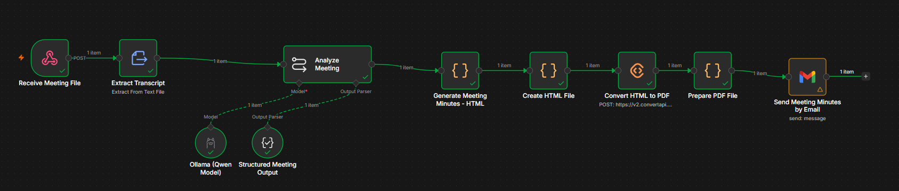
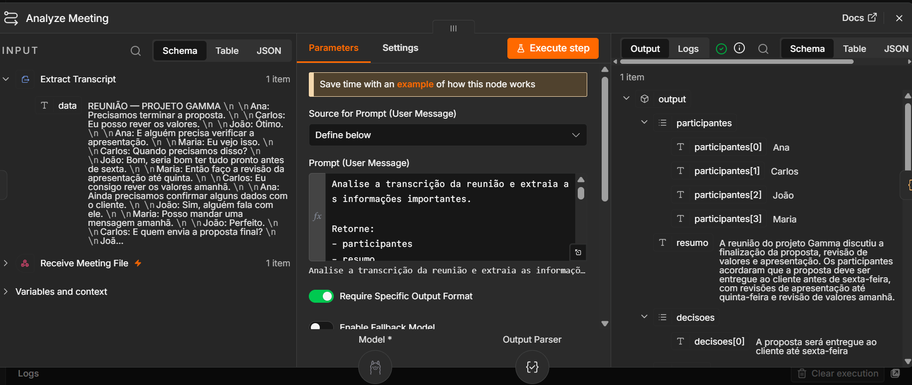
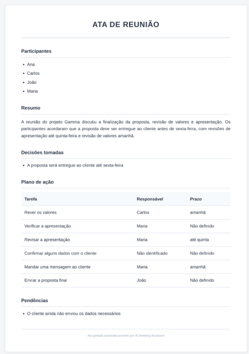
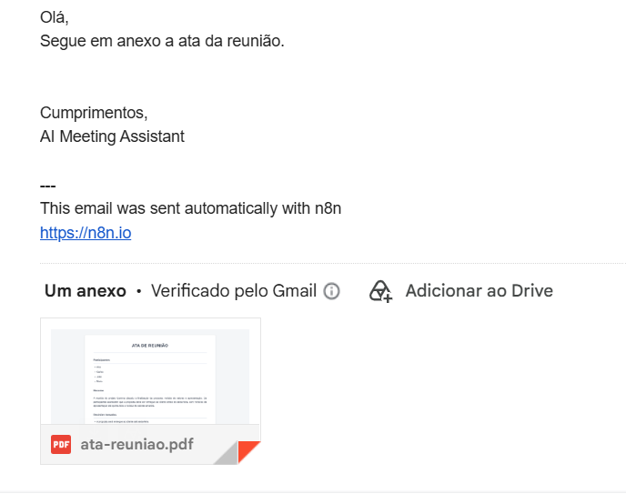

# AI Meeting Assistant

> Geração automatizada de atas de reuniões utilizando n8n, LLM local e envio automático de PDF por e-mail.

## Sobre o projeto

O AI Meeting Assistant é um workflow de automação desenvolvido com **n8n** que transforma uma transcrição de reunião em uma ata estruturada e profissional.

O workflow recebe um arquivo de transcrição, extrai o seu conteúdo, utiliza um **LLM Qwen através do Ollama** para analisar a reunião, estrutura as informações extraídas, gera um documento HTML, converte-o para PDF e envia automaticamente o documento por e-mail.

O objetivo é automatizar o trabalho repetitivo envolvido na criação de atas, mantendo as informações organizadas e fáceis de consultar.

---

## 📸 Demonstração

### Workflow



### Análise com IA



### Ata gerada



### Envio por e-mail



## Problema

Criar atas de reuniões manualmente após uma reunião pode consumir bastante tempo.

Informações importantes como:

- decisões;
- tarefas atribuídas;
- responsáveis;
- prazos;
- pendências;
- participantes;

podem ser esquecidas ou exigir organização manual adicional.

O objetivo deste projeto é automatizar esse processo desde a transcrição até ao documento final.

---

## Solução

O workflow segue o processo:

**Transcrição → Análise com IA → Dados estruturados → HTML → PDF → E-mail**

A IA analisa a transcrição e extrai:

- Participantes
- Resumo
- Decisões
- Tarefas
- Responsáveis
- Prazos
- Pendências

As informações estruturadas são então utilizadas para gerar uma ata profissional.

---

## Workflow

```text
Receive Meeting File
        ↓
Extract Transcript
        ↓
Analyze Meeting
   ├── Ollama — Qwen Model
   └── Structured Meeting Output
        ↓
Generate Meeting Minutes HTML
        ↓
Create HTML File
        ↓
Convert HTML to PDF
        ↓
Prepare PDF File
        ↓
Send Meeting Minutes by Email
